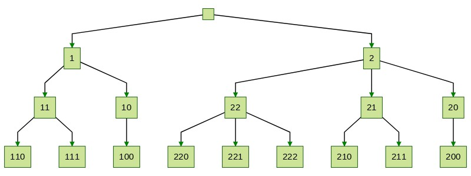
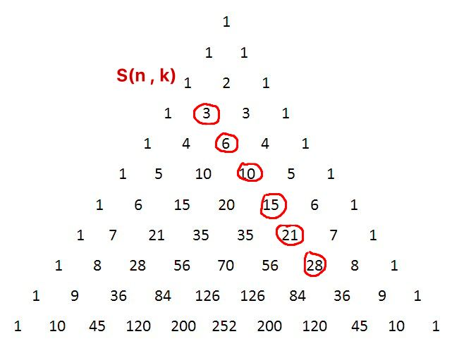
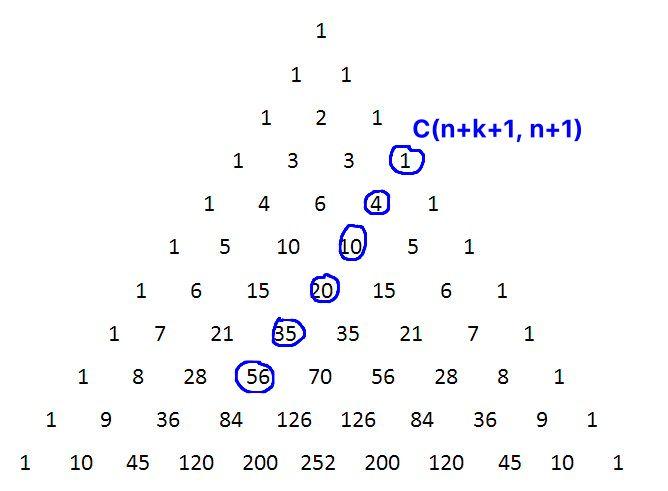
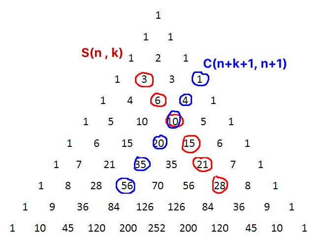

## Notes on the representatives tree


We can think of a `number` of length N as a node in a tree. Its child numbers of length N+1 are given by
```java
for (int k = lastDigitOf(number); k >= 0; k--) {
    String child = number + k; // '+' is append
}
```

A level-3 tree for numbers 1 and 2 looks like this:



Let `S(n,k)` be the number of nodes in a level-`n` tree rooted in `k`. In the example above we have: `S(3,1) = 6` and 
`S(3,2) = 10`. The tree rooted in `2` is comprised of the tree rooted in `22` and it's complement, this is true in general
and we have:

```
S(n, k) = S(n-1, k) + S(n,k-1)
S(1, k) = 1
S(n, 0) = n
```

This is similar to the recurrence satisfied by the [binomial coefficient](https://en.wikipedia.org/wiki/Binomial_coefficient) 
`C(n,k)` and it turns out that: `S(n, k) = C(n+k, k+1)`

We can trace the `S(n, k)`'s path on the [Pascal's triangle](https://en.wikipedia.org/wiki/Pascal%27s_triangle), here `n=3`:



We also know that the sum of values in a diagonal of Pascal triangle is:  `C(n,n) + C(n+1,n) + ... + C(n+k,n) = C(n+k+1, n+1)`
again, an example with `n=3`:




Due to symmetry we can flip around the diagonal and shift up by one. 



After accounting for `k` in `(1..9)` we have that for a fixed `n`:

``
S(n) = S(n,1) + S(n,2) + ... S(n,9) = C(n + 9 + 1, n) - n - 1
`` 
and so: `S(39) = C(49, 39) - n - 1 = 8_217_822_496` 
